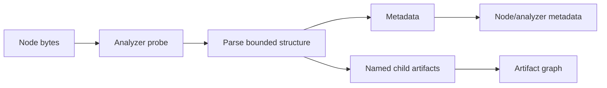

# Analyzer Pipeline

Analyzers inspect structure rather than only transform encoding. They identify containers, executables, embedded objects, or metadata and may emit named child artifacts.

## Built-in analyzers

- ZIP and TAR analyzers enumerate bounded members and reject unsafe expansion.
- PE and ELF analyzers extract executable structure and metadata.
- PDF and OLE support in the decoding layer performs structural extraction for embedded objects and streams.

## Artifact contract

An emitted artifact should include bounded bytes, a stable artifact name, the producing analyzer identity, and enough metadata for provenance. Archive member paths and OLE stream paths must be normalized and must never be used for unsafe filesystem writes.

## Safety rules

- Cap member count, per-member size, total extracted size, and compression ratio.
- Do not trust filenames, paths, offsets, lengths, or declared counts.
- Validate boundaries before slicing or allocating.
- Skip malformed entries without crashing the whole run.
- Preserve errors in logs or trace output when useful, but do not leak raw sensitive data.

## Testing

Use minimal valid fixtures, truncated variants, oversized declarations, duplicate members, path traversal names, nested archives, and deterministic ordering assertions.
