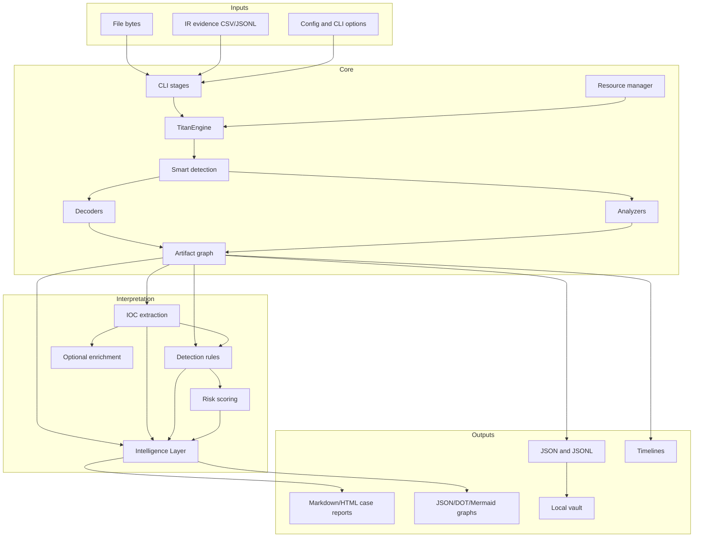

# Architecture

Titan is organized as a deterministic, bounded analysis pipeline. Transformation code produces artifacts; interpretation code evaluates the resulting report; exporters serialize completed state.

## System boundaries

## Key design rules

1. The byte-analysis engine does not depend on case-report or UI rendering.
2. The same artifact graph feeds IOC, detection, risk, Intelligence, timeline, and graph exports.
3. Intelligence consumes completed report state and does not modify evidence.
4. Optional enrichment is separated from deterministic local analysis.
5. Resource controls apply before recursion can create unbounded work.
6. Stable ordering and hashes make repeated runs comparable.

## Repository map

- `titan_decoder/core/engine.py` — recursive orchestration and report construction.
- `titan_decoder/decoders/` — reversible or heuristic transformations.
- `titan_decoder/core/analyzers/` — structured file and archive analysis.
- `titan_decoder/core/intelligence.py` — deterministic analyst summary.
- `titan_decoder/core/detection_rules.py` — detection evaluation.
- `titan_decoder/core/risk_scoring.py` — operational risk.
- `titan_decoder/core/graph_export.py` — graph serialization.
- `titan_decoder/core/case_report.py` — Markdown/HTML reports.
- `titan_decoder/plugins.py` — plugin discovery and loading.
- `tests/` — unit, contract, corpus, safety, and regression suites.

## Trust boundaries

Input bytes, artifact names, previews, rule-pack content, evidence fields, and plugin output are untrusted. Renderers must escape text. Decoders and analyzers must cap expansion. Plugins run in-process and therefore inherit the process trust level.

## Data ownership

The primary report is the handoff object between stages. Exporters should read it rather than independently recomputing detections, risk, or Intelligence. This keeps outputs consistent and avoids drift.
