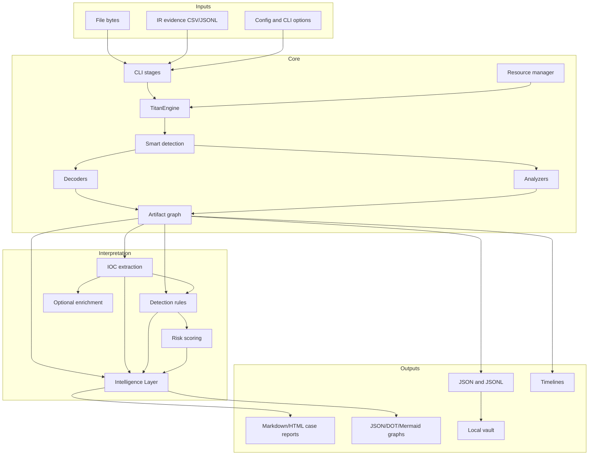
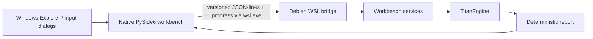

# Architecture

Titan is organized as a deterministic, bounded analysis pipeline. Transformation code produces artifacts; interpretation code evaluates the resulting report; exporters serialize completed state.

## System boundaries

## Windows desktop boundary

The native Windows interface is deliberately separated from Debian analysis:

`titan_decoder.desktop_ui.debian_services` translates Windows paths to `/mnt`
paths and invokes `titan_decoder.desktop_ui.debian_bridge` inside the selected
Debian distribution. The bridge transfers report state back to the native UI;
it verifies protocol and decoder-inventory compatibility, routes analysis,
manual decoders, and deep scans through the same backend, and supports bounded
timeouts plus cancellation. It does not create a detonation or VM isolation boundary. See
[WINDOWS_DESKTOP_UI.md](WINDOWS_DESKTOP_UI.md) for setup and operation.

## Key design rules

1. The byte-analysis engine does not depend on case-report or UI rendering.
2. The same artifact graph feeds IOC, detection, risk, Intelligence, timeline, and graph exports.
3. Intelligence consumes completed report state and does not modify evidence.
4. Optional enrichment is separated from deterministic local analysis.
5. Resource controls apply before recursion can create unbounded work.
6. Stable ordering and hashes make repeated runs comparable.

## Repository map

- `titan_decoder/core/engine.py` — recursive orchestration and report construction.
- `titan_decoder/decoders/` — reversible or heuristic transformations.
- `titan_decoder/core/analyzers/` — structured file and archive analysis.
- `titan_decoder/core/intelligence.py` — deterministic analyst summary.
- `titan_decoder/core/detection_rules.py` — detection evaluation.
- `titan_decoder/core/risk_scoring.py` — operational risk.
- `titan_decoder/core/graph_export.py` — graph serialization.
- `titan_decoder/core/case_report.py` — Markdown/HTML reports.
- `titan_decoder/desktop_ui/` — native PySide6 frontend and Debian WSL bridge.
- `titan_decoder/workbench_ui/` — Textual terminal frontend and shared workbench services.
- `titan_decoder/plugins/` — plugin contracts, discovery, isolated workers, and validation.
- `titan_decoder/core/deep_scan.py` — recursive static scan orchestration.
- `titan_decoder/core/quarantine.py` — hash-addressed recoverable quarantine.
- `titan_decoder/core/calibration.py` — labeled decoder/analyzer quality metrics.
- `tests/` — unit, contract, corpus, safety, and regression suites.

## Trust boundaries

Input bytes, artifact names, previews, rule-pack content, evidence fields, and
plugin output are untrusted. Renderers must escape text. Decoders and analyzers
must cap expansion. Manifest plugins run in short-lived child processes by
default; legacy single-file plugins and explicit plugin validation remain
in-process compatibility/developer boundaries.

## Data ownership

The primary report is the handoff object between stages. Exporters should read it rather than independently recomputing detections, risk, or Intelligence. This keeps outputs consistent and avoids drift.
