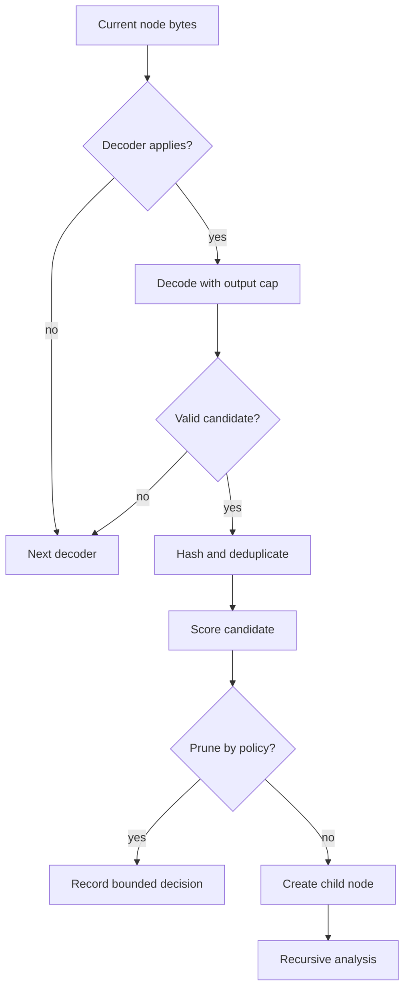

# Decoder Engine

Decoders transform one byte representation into another candidate representation. They are not responsible for final verdicts, risk, or analyst-facing conclusions.

## Lifecycle

1. The engine receives bytes for a node.
2. Smart detection and decoder applicability checks reduce unnecessary work.
3. Enabled decoders produce zero or more bounded candidates.
4. Candidate quality is scored.
5. Content hashes prevent duplicate exploration.
6. Accepted candidates become child nodes with explicit parentage.
7. Recursion continues until a hard or policy limit is reached.

## Built-in transformations

The default set includes Base64 variants, PEM armor, common compression formats, Hex, ROT13, URL decoding, HTML entities, Unicode escapes, UTF-16, XOR, PDF, and OLE processing. Base32, UUEncode, ASN.1, and Quoted-Printable are opt-in or smart-detected because they can create noisy candidates on arbitrary data.

## Determinism requirements

A decoder must use stable names, stable candidate ordering, and deterministic scoring inputs. Random sampling, environment-dependent ordering, and implicit network access are not permitted in the deterministic path.

## Resource requirements

Expansion-capable decoders must cap output before allocating unbounded buffers. Repeated-key searches must constrain key lengths and sampled scoring. Decompression must enforce total output limits and reject expansion bombs.

## Adding a decoder

- Implement the decoder base interface used by `titan_decoder.decoders.base`.
- Add configuration wiring in the engine.
- Add applicability, success, malformed-input, determinism, and resource-bound tests.
- Document whether the decoder is always enabled, opt-in, or smart-detected.
- Keep transformation metadata sufficient for provenance and edge labels.
