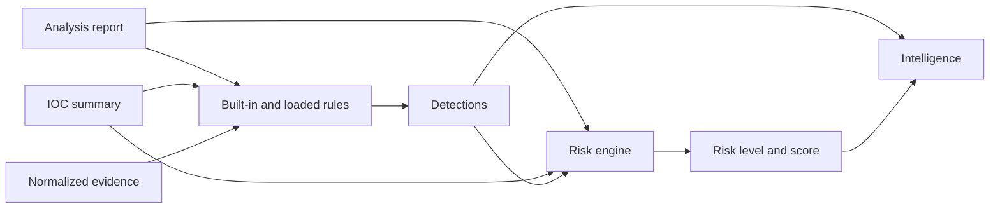

# Detection Engine and Risk Scoring

## Separation of concerns

Detection rules answer whether defined behavior or correlations are present. Risk scoring answers how urgently the completed analysis should be treated. Intelligence provides a separate analyst-facing synthesis.

## Rule packs

External rule packs must have stable IDs, explicit versions, and bounded expressions. Treat rule packs as trusted configuration and review them before use.

Validation is enforced, not advisory, in two places with different strictness:

- **At load time** the engine validates every rule definition and skips
  invalid ones with a logged warning instead of loading them as silent
  no-ops. Duplicate IDs are rejected — within a pack, across packs, and
  against built-in rules (first definition wins) — and the `TITAN-` ID
  prefix is reserved, so a pack rule cannot impersonate a built-in.
  Per-pack `rules_loaded`/`rules_skipped` counts land in the report's
  `meta.rule_packs`.
- **`titan-decoder --rules-validate <pack>`** performs the same deep
  validation as a strict gate: every problem is reported per rule and the
  command exits non-zero. Run it in CI for any pack you maintain.

Enforced limits (constants in `titan_decoder/core/rule_packs.py`): at most
200 rules per pack (the whole pack is rejected beyond that — each
`content_regex` costs bounded-but-real evaluation time), 2048-character
patterns, 64-character IDs, 16 `ioc_types` per rule with `min_each` in
`[1, 10000]`, 16 `attack_ids` per rule in `T1234`/`T1234.001` form, regex
flags limited to IGNORECASE/MULTILINE/DOTALL, and severity one of
low/medium/high/critical. Patterns must compile at validation time.

Fixture packs demonstrating valid, duplicate-ID, and invalid rules live in
`tests/fixtures/rule_packs/` and back `tests/test_rule_pack_validation.py`.

## ATT&CK metadata

Every built-in rule carries static `attack_ids` — the MITRE ATT&CK technique IDs the rule indicates — and rule packs can declare the same field per rule. Triggered detections expose `attack_ids`, and the Threat Intelligence Engine consumes them as corroborating technique evidence (see [THREAT_INTELLIGENCE.md](THREAT_INTELLIGENCE.md)). A test asserts that every referenced ID exists in the bundled ATT&CK catalog, so rules and catalog cannot drift apart.

## Risk output

Risk is deterministic and bounded. The CLI can fail a pipeline based on a configured minimum risk level. Unknown risk labels should not silently pass.

## Testing

Add tests for positive detection, close benign controls, malformed rules, duplicate identifiers, catastrophic regular-expression behavior, and score boundaries.
