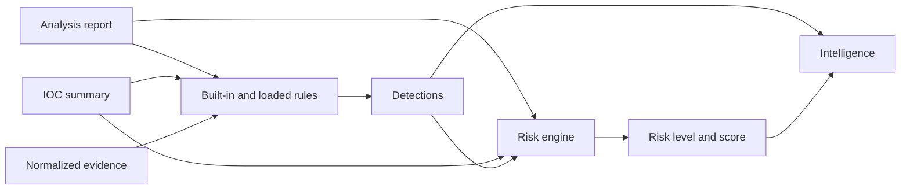

# Detection Engine and Risk Scoring

## Separation of concerns

Detection rules answer whether defined behavior or correlations are present. Risk scoring answers how urgently the completed analysis should be treated. Intelligence provides a separate analyst-facing synthesis.

## Rule packs

External rule packs should have stable IDs, explicit versions, bounded expressions, duplicate-ID validation, and fixtures. Treat rule packs as trusted configuration and review them before use.

## ATT&CK metadata

Every built-in rule carries static `attack_ids` — the MITRE ATT&CK technique IDs the rule indicates — and rule packs can declare the same field per rule. Triggered detections expose `attack_ids`, and the Threat Intelligence Engine consumes them as corroborating technique evidence (see [THREAT_INTELLIGENCE.md](THREAT_INTELLIGENCE.md)). A test asserts that every referenced ID exists in the bundled ATT&CK catalog, so rules and catalog cannot drift apart.

## Risk output

Risk is deterministic and bounded. The CLI can fail a pipeline based on a configured minimum risk level. Unknown risk labels should not silently pass.

## Testing

Add tests for positive detection, close benign controls, malformed rules, duplicate identifiers, catastrophic regular-expression behavior, and score boundaries.
