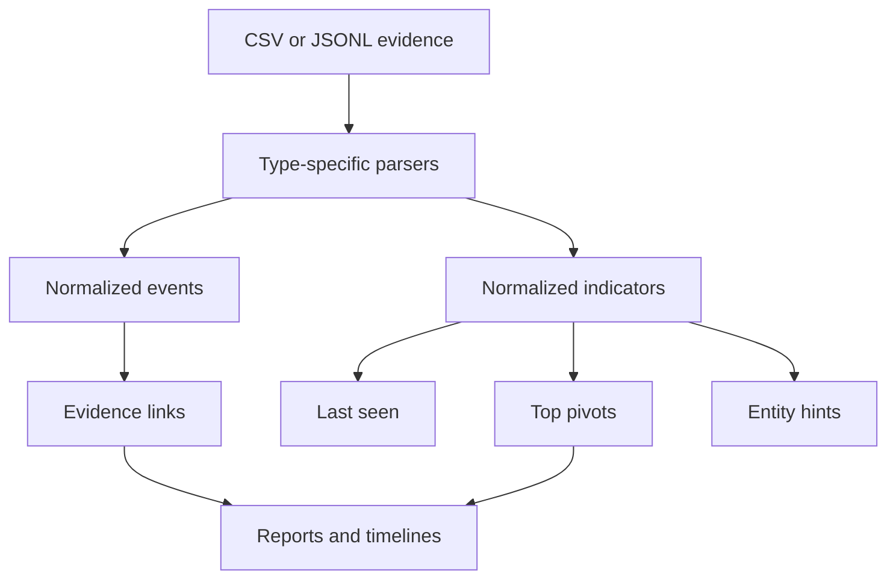

# Evidence and Provenance

## Provenance

Each artifact node records how it was created:

- node and parent IDs;
- depth;
- method and decoder/analyzer;
- source and decoded lengths;
- SHA-256;
- entropy and content type;
- score and pruning state;
- artifact name;
- derivation record.

This makes every exported artifact traceable to the source input.

## External evidence

Titan accepts normalized ingestion from DNS, proxy, firewall, VPN, authentication, DHCP, and generic exports. Parsers produce events and indicators with source context.

## Correlation principles

Correlation must preserve source provenance, use deterministic ordering, avoid treating the current run as a prior match, and expose reason codes rather than opaque confidence alone.

## Privacy

Evidence frequently contains personal or operational data. Keep case files out of public repositories, enable redaction for logs, and control vault access.
