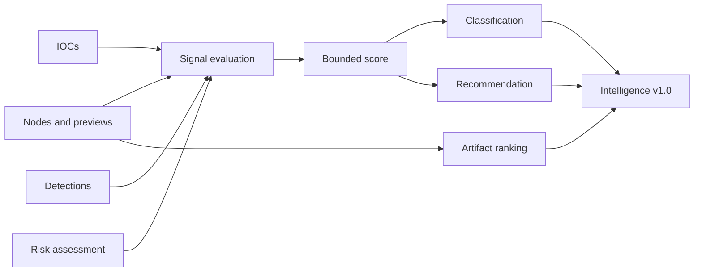

# Intelligence Layer

The Intelligence Layer converts completed Titan report state into an analyst-oriented, deterministic summary: a 0–100 score, a classification, ordered explainable signals, ranked artifacts, and a recommendation.

The layer is heuristic, dependency-free, and offline. It is **not** a generative AI model and does not upload report data.

## Inputs

- graph nodes;
- IOC summary (built with the same evidence merge as the detection stage);
- detection results;
- risk assessment.

## Flow



## Output contract

`IntelligenceEngine.analyze()` emits an object conforming to
`schemas/intelligence-report-v1.0.schema.json`. Version `1.0` contains:

- `intelligence_score` from 0 to 100;
- `classification`;
- normalized confidence;
- ordered scored signals, each with `code`, `points`, and `summary`;
- ranked `top_artifacts` retaining node identity, score, and reasons;
- analyst recommendation.

Version `1.0` guarantees:

- required top-level fields remain present;
- scores stay within `0..100`;
- classifications and their score thresholds remain stable;
- output is deterministic for the same input report.

Adding optional fields is compatible only after the JSON Schema permits them.
Removing or renaming fields, changing types, changing thresholds, or changing
existing signal semantics requires a new contract version.

## Classifications

| Score | Classification |
|---:|---|
| 0–15 | `CLEAN` |
| 16–35 | `LOW_RISK_ARTIFACT` |
| 36–60 | `SUSPICIOUS_OBJECT` |
| 61–80 | `HIGH_RISK_PAYLOAD` |
| 81–100 | `LIKELY_MALICIOUS` |

If analysis stops with an empty, partial, unrecognized, or safety-limited
payload and no intelligence signals are found, the classification is
`NO_SIGNALS_DETECTED` instead of `CLEAN`. This distinction means the engine
found no risk signal, but did not obtain enough interpreted content to make a
benign assessment; the recommendation explicitly requires manual review.

The thresholds are compatibility-sensitive and covered by tests. Changes must
be deliberate and should normally require a new calibration corpus or contract
version.

## Artifact ranking

Artifact ranking is separate from report classification. Nodes gain points for properties such as deep decoding, high entropy, high-confidence transformations, execution context, network indicators, or recognizable structures.

## CLI

```bash
titan cli --file suspicious.bin --enable-detections --explain --out report.json
```

```bash
titan cli --file suspicious.bin --enable-detections \
  --intelligence-out intelligence.json --out report.json
```

`--explain` writes to stderr so JSON stdout remains pipeline-safe. The
Intelligence object is attached to every normal report; detection and risk
signals are richer when `--enable-detections` is set.

## Calibration corpus

`tests/fixtures/intelligence/calibration-v1.json` is the deterministic
calibration corpus. Each case includes:

- a small normalized Titan report;
- the exact expected intelligence score;
- the expected classification;
- ordered signal codes;
- ordered top-artifact node IDs.

The corpus is deliberately synthetic and contains no live indicators or
incident data. It locks exact scores, classifications, signal order, and top
artifact IDs for representative reports.

### Updating behavior safely

1. Add a focused corpus case that demonstrates the intended behavior.
2. Run the full test suite.
3. Review score changes across every existing calibration case.
4. Preserve existing results unless the behavior change is intentional.
5. For an incompatible change, add a new schema/corpus version instead of
   silently rewriting version `1.0`.

```bash
python -m pytest tests/test_intelligence.py tests/test_intelligence_contract.py
python -m pytest
```

The schema validation test uses the existing development dependency
`jsonschema`. It skips cleanly when only the dependency-free runtime package is
installed.

## Export integration

Case reports copy the existing Intelligence object, and graph exporters
receive that same object to annotate the graph. Neither recomputes scores or
rankings, so JSON, Markdown, HTML, DOT, and Mermaid outputs stay consistent.

Reports created without an `intelligence` object keep the previous layout and
do not display an empty Intelligence section. HTML rendering escapes
Intelligence content because previews, artifact names, rule names, and
evidence can originate from untrusted samples.
