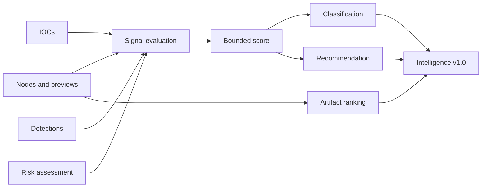

# Intelligence Layer

The Intelligence Layer converts completed Titan report state into an analyst-oriented, deterministic summary.

## Inputs

- graph nodes;
- IOC summary;
- detection results;
- risk assessment.

## Output contract

Version `1.0` contains:

- `intelligence_score` from 0 to 100;
- `classification`;
- normalized confidence;
- ordered scored signals;
- ranked `top_artifacts`;
- analyst recommendation.

The formal schema is `schemas/intelligence-report-v1.0.schema.json`.

## Flow

## Classification boundaries

The classification thresholds are compatibility-sensitive and covered by tests. Changes must be deliberate and should normally require a new calibration corpus or contract version.

## Artifact ranking

Artifact ranking is separate from report classification. Nodes gain points for properties such as deep decoding, high entropy, high-confidence transformations, execution context, network indicators, or recognizable structures.

## Calibration

The deterministic calibration corpus locks exact scores, classifications, signal order, and top artifact IDs for representative synthetic reports.

## Export integration

Case reports copy the existing Intelligence object. Graph exporters receive that object and annotate the graph. Neither exporter recomputes Intelligence.
