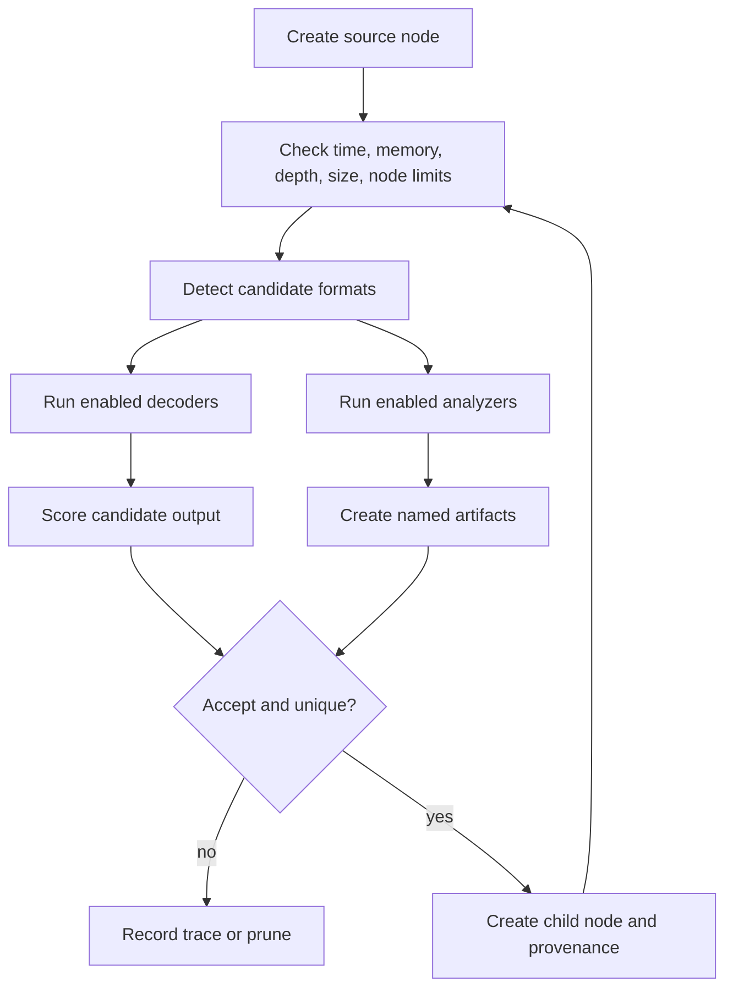

# Decoder and Analyzer Pipelines

## Recursive flow

## Decoder responsibilities

A decoder should cheaply determine whether it applies, transform bytes, reject malformed input without crashing, and provide a stable name. Expansion-capable decoders must enforce output limits. Heuristic decoders must avoid quadratic searches and return deterministic candidates.

## Analyzer responsibilities

An analyzer identifies structure rather than merely transforming bytes. It can emit metadata and child artifacts with names. Archive paths and structural stream names become provenance labels.

## Scoring and pruning

Titan separates candidate scoring from hard resource limits. A low score may be pruned by policy; depth, node, memory, timeout, and output-size limits are non-negotiable safety boundaries.

## Deduplication

Content hashes prevent the same decoded bytes from being explored repeatedly. Parentage remains explicit for accepted artifacts, while deterministic ordering makes tie handling stable.

## Error behavior

Malformed content should produce no candidate or a bounded error record—not terminate the run. Unexpected programmer errors may be logged and surfaced in verbose mode.
