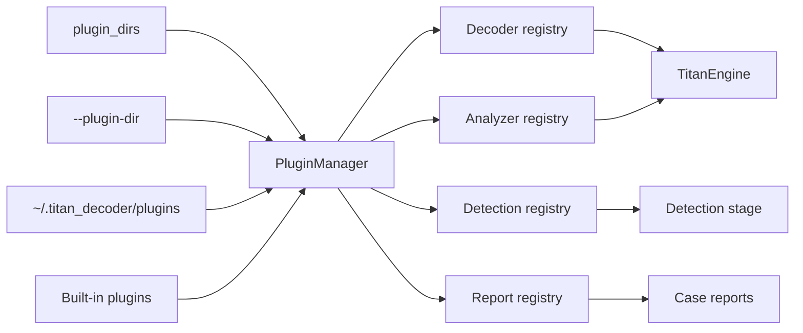

# Plugin SDK v1

Titan can be extended without modifying the core through four plugin SDKs:
**decoders**, **analyzers**, **detections**, and **report sections**. All
public types live in `titan_decoder.plugins.api` — third-party plugins import
only from that module; it is the compatibility surface covered by the
versioned API contract.

## Plugin styles

Two styles are supported side by side:

| Style | API | Layout | Capabilities |
|---|---|---|---|
| Single-file | 1.0 | one `.py` file in a plugin directory | decoder, analyzer |
| Manifest | 1.1 | a directory with `titan-plugin.json` + entry-point module | decoder, analyzer, detection, report |

Plugin directories are searched in this order: `plugin_dirs` from
configuration, `--plugin-dir` CLI arguments, `~/.titan_decoder/plugins`, and
the built-in plugin path. Every directory is scanned for both styles.

## API versioning

The engine provides `PLUGIN_API_VERSION` (currently `1.1`, MAJOR.MINOR):

- **MAJOR** bump = breaking change to base-class signatures or semantics.
- **MINOR** bump = additive, backward-compatible extension. (`1.1` added the
  manifest SDK; every API `1.0` plugin still loads and runs unchanged.)

Single-file plugins may declare a module-level `PLUGIN_API_VERSION`; they are
skipped on a MAJOR mismatch. Manifest plugins must declare `api_version` and
are loadable when the MAJOR matches and their declared MINOR is not newer
than the engine's.

Plugin `version` and dependency requirements use Semantic Versioning 2.0.0,
including correct pre-release precedence (`1.0.0-alpha < 1.0.0`). Dependency
requirements accept `*`, `^X.Y.Z`, `~X.Y.Z`, comparator lists
(`>=1.0.0,<2.0.0`), and exact versions.

## The manifest

Each manifest plugin directory contains `titan-plugin.json`
(schema: `schemas/titan-plugin-manifest-v1.0.schema.json`):

```json
{
  "schema_version": "1.0",
  "id": "example.rot47",
  "name": "ROT47 Decoder",
  "version": "1.0.0",
  "api_version": "1.1.0",
  "entry_point": "plugin:Rot47Decoder",
  "capabilities": ["decoder"],
  "description": "Reverses ROT47-obfuscated printable ASCII.",
  "author": "You",
  "license": "AGPL-3.0-or-later",
  "permissions": [],
  "dependencies": {}
}
```

- `id`: lowercase segments separated by `.`, `_`, or `-`; unique across
  loaded plugins.
- `entry_point`: `module:ClassName`, resolved relative to the plugin
  directory.
- `capabilities`: which SDK base classes the entry-point class implements.
- `permissions`: policy metadata (`filesystem.read`, `filesystem.write`,
  `network`, `configuration`). **Not a sandbox** — see the trust model.
- `dependencies`: other plugin IDs mapped to version requirements. Loading
  is dependency-ordered; unresolved or unsatisfied dependencies fail the
  plugin, never the run.

## Decoder SDK

```python
from titan_decoder.plugins.api import DecoderPlugin, DecodeResult

class Rot47Decoder(DecoderPlugin):
    priority = 10  # higher = tried first

    @property
    def name(self):
        return "ROT47"

    def can_decode(self, data, context=None):
        return bool(data) and all(b in b"\t\r\n" or 32 <= b <= 126 for b in data)

    def decode(self, data, context=None):
        out = bytes(((b - 33 + 47) % 94) + 33 if 33 <= b <= 126 else b for b in data)
        return DecodeResult(out, out != data, {"algorithm": "ROT47"})
```

`decode` may return a `DecodeResult` or a legacy `(bytes, bool)` tuple —
`DecodeResult` unpacks like the tuple, so both integrate identically.
Decoded candidates compete on the engine's deterministic decode score; the
best-scoring decoder wins the node.

## Analyzer SDK

```python
from titan_decoder.plugins.api import AnalyzerPlugin, AnalysisArtifact

class StringsAnalyzer(AnalyzerPlugin):
    @property
    def name(self):
        return "PrintableStrings"

    def can_analyze(self, data, context=None):
        ...

    def analyze(self, data, context=None):
        return [AnalysisArtifact("strings.txt", content, {"count": 3})]
```

Artifact names must be plain basenames (no path separators); artifacts
unpack like the legacy `(name, bytes)` tuples. Respect
`context.max_output_bytes` and `context.max_children`.

## Detection SDK

```python
from titan_decoder.plugins.api import DetectionPlugin, DetectionFinding

class MarkerDetection(DetectionPlugin):
    @property
    def name(self):
        return "Example Marker"

    @property
    def rule_ids(self):
        return ("EXAMPLE-001",)

    def detect(self, report, iocs, context=None):
        ...
        return [DetectionFinding(
            rule_id="EXAMPLE-001",
            name="Example Marker",
            description="Synthetic marker found",
            severity="medium",              # low | medium | high | critical
            attack_ids=("T1027",),          # optional ATT&CK techniques
            evidence=({"node_id": 2},),     # optional evidence references
        )]
```

Detection plugins run during `--enable-detections`, after the built-in rules
and rule packs and **before risk scoring**, so plugin findings contribute to
the risk assessment exactly like rule matches. Findings appear in
`report["detections"]` with `source: {"type": "plugin", ...}`.

Rules of the road (enforced at load and validation time):

- `rule_ids` must declare every rule the plugin can emit; undeclared
  findings are dropped.
- The `TITAN-` prefix is reserved for built-in rules — plugins cannot
  impersonate them.
- Rule IDs must be unique across all loaded plugins.
- At most 200 findings per plugin per run are accepted.

## Report SDK

```python
from titan_decoder.plugins.api import ReportPlugin, ReportSection

class SummaryReport(ReportPlugin):
    @property
    def name(self):
        return "Example Summary"

    def build_sections(self, report, context=None):
        return [ReportSection(
            section_id="example_summary",
            title="Example Plugin Summary",
            content={"node_count": report.get("node_count", 0)},
            order=900,                       # lower renders first
            formats=("json", "markdown", "html"),
        )]
```

Sections must be JSON-serializable. They are embedded in the JSON report
under `plugin_report_sections` and rendered into Markdown/HTML case reports
(`--report-out`) for the formats each section declares. At most 20 sections
per plugin per run are accepted.

## PluginContext

SDK methods receive an optional `PluginContext` describing the run:
`config` (a read-only snapshot), `offline` (honor it — perform no network
access when set), `max_input_bytes`, `max_output_bytes`, `max_children`, and
`working_directory`. Plugins must also work when `context` is `None`.

## Validation

```bash
titan-decoder --plugin-validate path/to/plugin        # repeatable; exits non-zero on failure
titan-decoder --plugin-list --plugin-dir examples/plugins
```

`--plugin-validate` checks the manifest contract, API compatibility, the
entry point, declared capabilities, and the constructor, then runs a bounded
runtime probe verifying return types, output limits, artifact naming,
declared rule IDs, and execution time. The probe executes plugin code
in-process — only validate plugins you would be willing to run.
`--plugin-list` prints everything discovered, including per-plugin load
errors.

## Contract every plugin must uphold

Enforced by the fuzz invariants and the validation probe:
`can_decode`/`can_analyze`, `decode`, `analyze`, `detect`, and
`build_sections` must **never raise**, must return the declared types, must
bound their output, and must terminate quickly on any input, including
hostile bytes. A plugin that violates the contract at runtime is skipped
with a warning; plugins can extend an analysis but never abort one.

## Loading model



Manifest plugins load in dependency order (deterministic topological order
over declared dependencies). A plugin that fails to load is recorded in the
manager's error list — visible via `--plugin-list` — and never aborts
discovery.

## Trust model

Plugins execute in the Titan process and can access local resources.
Manifest permissions are declarations for operators and reviewers, not an
enforcement boundary. Only install reviewed plugins. A future out-of-process
plugin boundary would require a separate protocol and is not implied by the
current API.

## Examples and testing

Complete working examples — one per capability — live in
`examples/plugins/`: `rot47_decoder`, `string_analyzer`, `marker_detection`,
and `summary_report`. All four pass `--plugin-validate` and are exercised by
the test suite (`tests/test_plugin_sdk.py`,
`tests/test_plugin_sdk_integration.py`).

Every plugin should include applicability, success, malformed-input,
determinism, and resource-bound tests.
