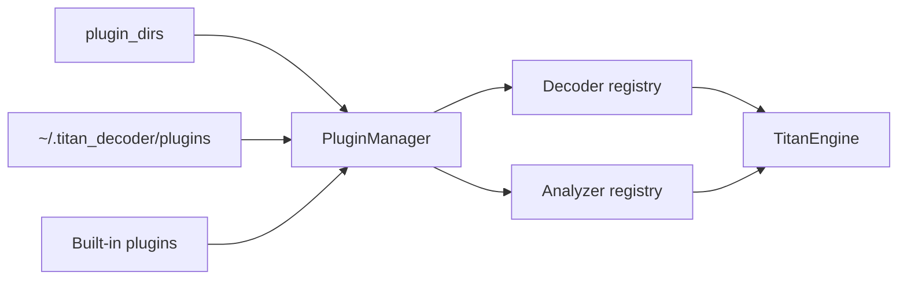

# Plugin API

Titan discovers plugin decoders and analyzers through configured directories, the user plugin directory, and built-in plugin paths.

## Decoder plugin expectations

- implement the decoder base interface;
- expose a stable `name`;
- reject non-matching input cheaply;
- return bytes and deterministic metadata;
- cap output growth;
- avoid network access;
- handle malformed content without crashing.

## Analyzer plugin expectations

- implement the analyzer base interface;
- emit structured metadata or bounded child artifacts;
- preserve meaningful artifact names;
- sanitize paths;
- cap member count, total size, and per-member size.

## Loading model

## Trust model

Plugins execute in the Titan process and can access local resources. Only install reviewed plugins. A future out-of-process plugin boundary would require a separate protocol and is not implied by the current API.

## Testing

Every plugin should include applicability, success, malformed-input, determinism, and resource-bound tests.
